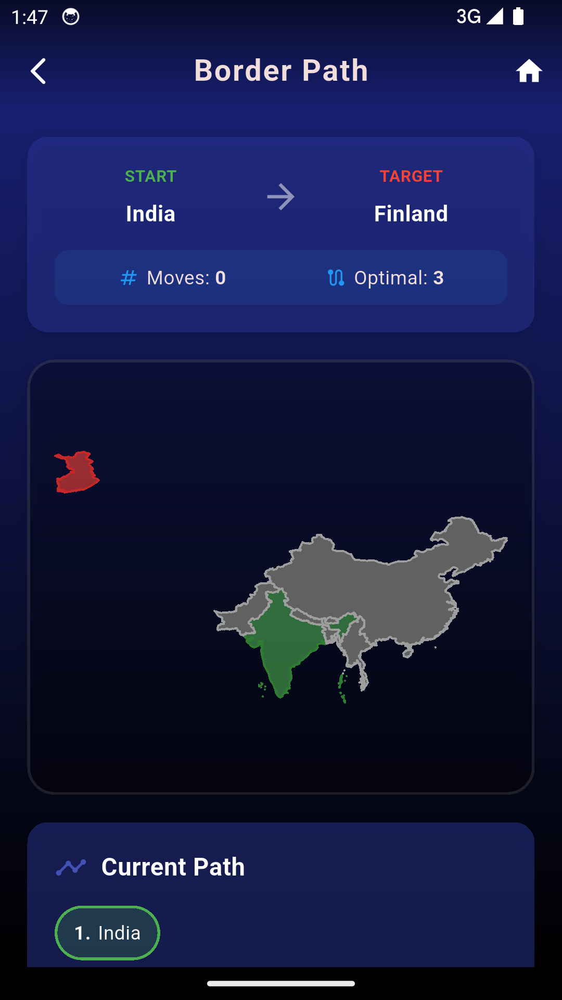
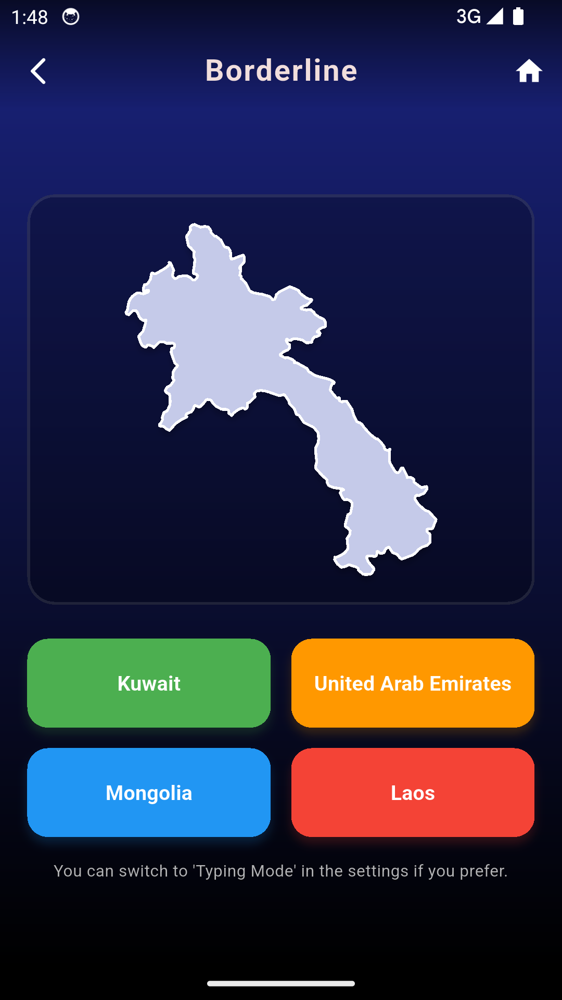
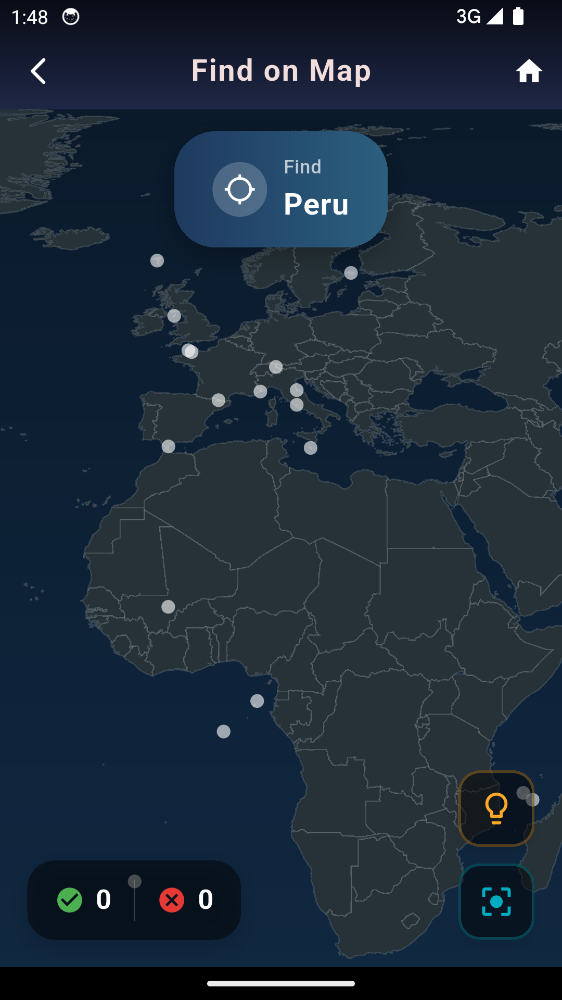
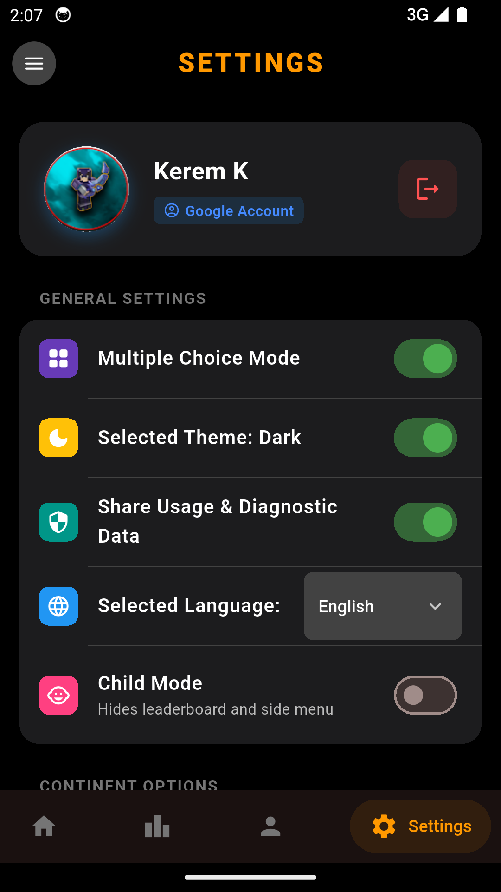

# 🌍 GeoGame

<p align="center">
  
</p>

<p align="center">
  <a href="https://github.com/keremkuyucu/GeoGame/releases"></a>
  <a href="https://github.com/keremkuyucu/GeoGame/releases"></a>
  <a href="https://geogame.keremkk.com.tr"></a>
  <a href="LICENSE"></a>
</p>

---

**GeoGame** is a modern, cross-platform geography trivia and strategy game designed to test and sharpen your world knowledge through interactive challenges.

* 🎮 **7 Unique Game Modes:** Coat of Arms, Flags, Capitals, Distance (Wordle-style), Borderline, Border Path, and Interactive Map.
* 📱 **Cross-Platform:** Available on **Android**, **Windows (Desktop)**, and **Web**.
* 🌐 **Full 7-Language Localization:** English 🇬🇧, Turkish 🇹🇷, German 🇩🇪, French 🇫🇷, Spanish 🇪🇸, Portuguese 🇵🇹, Russian 🇷🇺.
* 🏆 **Competitive & Social:** Real-time global leaderboards, detailed player stats, and secure PIN-protected Child Mode.
* 📴 **Offline Ready:** Play without an internet connection; scores automatically sync when reconnected.

---

## 🚀 Play & Download

* 🌐 [**Official Web App**](https://geogame.keremkk.com.tr) – Play instantly in your browser.
* 📦 [**GitHub Releases**](https://github.com/keremkuyucu/GeoGame/releases/latest) – Download Windows desktop installers and Android APKs.
* 📱 [**Google Play Store**](https://play.google.com/store/apps/details?id=com.keremkuyucu.geogame) – Get it on your Android device.

---

## 🎮 Game Modes

| Mode | Description |
| :--- | :--- |
| 🛡️ **Coat of Arms (Arma Avı)** | Identify countries by their official royal coats of arms, national emblems, and historic heraldry. *(New in v1.6.10)* |
| 🚩 **Flag Quiz (Bayrak Avı)** | Recognize national flags from hundreds of countries and overseas territories. |
| 🏛️ **Capital Quiz (Başkent Avı)** | Guess the capital city of each target country with multiple-choice or keyboard search. |
| 🧭 **Distance Game (Mesafe Avı)** | Wordle-inspired guessing game: receive kilometer distance and compass directions after each attempt. |
| 🗺️ **Borderline (Sınır Hattı)** | Identify a country purely by its geographical border outline and silhouette. |
| 🛤️ **Border Path (Sınır Yolu)** | Strategic puzzle: navigate from a starting nation to a target nation by stepping only through neighboring borders in minimal moves. |
| 🔍 **Find on Map (Haritada Bul)** | Locate and tap the requested country directly on the interactive world map. |

---

## 🖼️ Screenshots

### 🎮 Gameplay Modes
| Coat of Arms | Flag Quiz | Capital Quiz | Distance Game |
| :---: | :---: | :---: | :---: |
|  |  |  |  |

| Border Path | Borderline | Find on Map | Settings & Themes |
| :---: | :---: | :---: | :---: |
|  |  |  |  |

### 🏆 Menu & Community
| Main Lobby | Global Leaderboard | Profile & Stats |
| :---: | :---: | :---: |
|  |  |  |

---

## 🛠️ Local Setup & Development

To build and run the project locally:

1. **Clone the Repository:**
   ```bash
   git clone https://github.com/keremkuyucu/GeoGame.git
   cd GeoGame
   ```

2. **Install Flutter Dependencies:**
   ```bash
   flutter pub get
   ```

3. **Run the App:**
   ```bash
   # Windows Desktop
   flutter run -d windows

   # Android Device / Emulator
   flutter run -d android

   # Web Browser
   flutter run -d chrome
   ```

4. **Useful Scripts (`scripts/`):**
   * `scripts/take_screenshots.ps1`: Interactive ADB tool to take full-screen device screenshots into `screenshots/`.
   * `scripts/build-and-deploy.ps1`: Automated build pipeline for Web (Vercel), Windows (Inno Setup + SignTool), APK, and AAB.

---

## 📜 License

This project is licensed under the **GNU General Public License v3.0**. See the [LICENSE](LICENSE) file for details.

---

## 🙋‍♂️ Author

- [**Kerem Kuyucu**](https://github.com/keremkuyucu)
