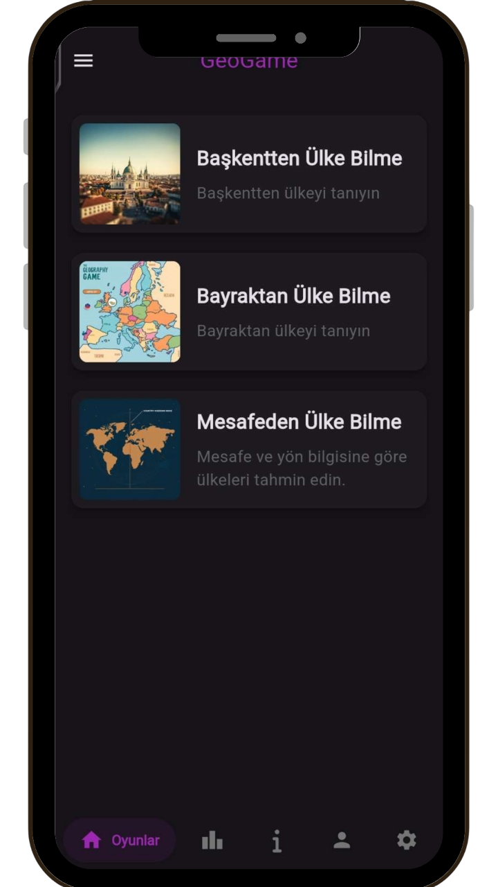

# 🌍 GeoGame

<p align="center">
  
</p>

<p align="center">
  
  
  
</p>

---

**GeoGame** is a cross-platform educational game designed to test and improve geographical knowledge through interactive challenges.

🎮 **Game Modes:** Capitals, Flags, Distance Estimation, and Continent-specific levels.  
📱 **Platforms:** Android, Windows (Desktop).  
🌐 **Localization:** Fully supports **English** 🇬🇧 and **Turkish** 🇹🇷.

---

## 🚀 Access & Downloads

* 🌍 [**Official Website**](https://geogame.keremkk.com.tr) - Updates and web access.
* 📦 [**Latest Release**](https://github.com/keremkuyucu/GeoGame/releases/latest) - Download Windows binaries and Android APKs.

---

## 🖼️ Screenshots

### Gameplay Experience
| Capital Quiz | Flag Quiz | Distance Game |
| :---: | :---: | :---: |
|  |  |  |

### Interface & Social
| Main Lobby | Leaderboard | Profile & Settings |
| :---: | :---: | :---: |
|  |  |  |

---

## 🛠️ Local Setup & Development

To run the project locally, follow these steps:

1.  **Clone the Repository:**
    ```bash
    git clone https://github.com/keremkuyucu/GeoGame.git
    ```

2.  **Install Dependencies:**
    ```bash
    flutter pub get
    ```

3.  **Configure Supabase:**
    Provide your `SUPABASE_URL` and `SUPABASE_ANON_KEY` in your configuration main file

4.  **Launch the App:**
    ```bash
    flutter run
    ```

---

## 🧩 Project Ecosystem

GeoGame consists of several open-source modules:

* [**keremkk-auth**](https://github.com/keremkuyucu/keremkk-auth): Centralized account management.
* [**geogame-cdn**](https://github.com/keremkuyucu/geogame-cdn): Data source for country information and assets.
* [**GeoGameCPP**](https://github.com/keremkuyucu/GeoGameCPP): The legacy core version developed in C++.

---

## 🤝 Contributing

Contributions are welcome. Please follow these steps:

1. Fork the repository.
2. Create a feature branch (`git checkout -b feature/NewFeature`).
3. Commit your changes (`git commit -m 'Add NewFeature'`).
4. Push to the branch (`git push origin feature/NewFeature`).
5. Open a Pull Request.

---

## 📜 License

This project is licensed under the **GNU General Public License v3.0**. See the [LICENSE](LICENSE) file for details.

---

## 🙋‍♂️ Author

**Kerem Kuyucu** - [GitHub Profile](https://github.com/keremkuyucu)  
📍 Bilecik, Türkiye
